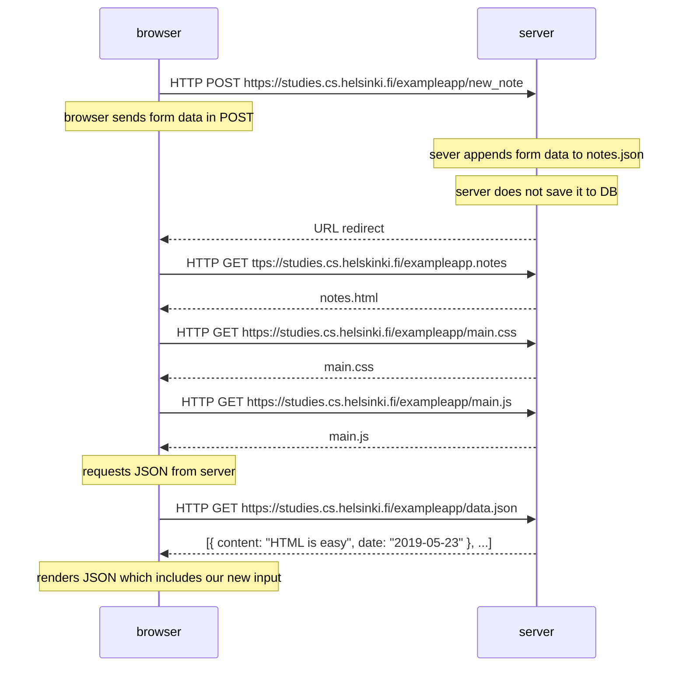

# Form Request Diagram

```mermaid
sequenceDiagram
    browser->>server: HTTP POST https://studies.cs.helsinki.fi/exampleapp/new_note
    Note over browser: browser sends form data in POST
    Note over server: sever appends form data to notes.json
    Note over server: server does not save it to DB
    server-->>browser: URL redirect
    browser->>server: HTTP GET ttps://studies.cs.helskinki.fi/exampleapp.notes
    server-->>browser: notes.html
    browser->>server: HTTP GET https://studies.cs.helsinki.fi/exampleapp/main.css
    server-->>browser: main.css
    browser->>server: HTTP GET https://studies.cs.helsinki.fi/exampleapp/main.js
    server-->>browser: main.js
    Note over browser: requests JSON from server
    browser->>server: HTTP GET https://studies.cs.helsinki.fi/exampleapp/data.json
    server-->>browser: [{ content: "HTML is easy", date: "2019-05-23" }, ...]
    Note over browser: renders JSON which includes our new input
```
